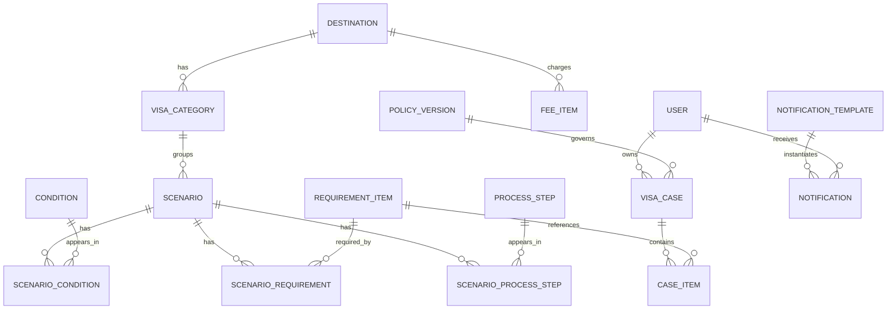

# 签证指南数据库设计

## 1. 设计原则

- 规则与内容数据驱动，规则版本化可追溯。
- 多语言字段用 JSONB，金额用最小单位整数 + 货币代码。
- 时间统一 UTC，软删除保留审计与关联。

## 2. ERD

## 3. 逐表说明

### 规则与内容域

- `destinations`：目的地国家或地区（日本、韩国、申根法/德/意、美国）。
- `visa_categories`：签证类型，第一版只有 tourist，预留 student/business/family_visit。
- `scenarios`：适用场景，描述条件组合；同一目的地+类型可有多个场景（如首签/续签）。
- `conditions`：条件项定义（护照有效期、户籍、是否首签、出行目的等）。
- `scenario_conditions`：场景与条件多对多，并带运算符与期望值，构成匹配规则。
- `requirement_items`：材料项（护照、照片、在职证明、银行流水等）。
- `scenario_requirements`：场景所需材料及是否必选、份数、说明。
- `process_steps`：办理步骤（填表、预约、递签、取签）。
- `scenario_process_steps`：场景步骤排序与预计耗时。
- `fee_items`：费用项（签证费、服务费等），金额用最小单位整数。
- `policy_versions`：规则版本，含生效时间、发布状态、备注。

### 用户案例域

- `users`：用户、登录方式、语言偏好、通知偏好。
- `visa_cases`：一次办理案例，绑定目的地、类型、当前答案 JSONB、状态、进度。
- `case_items`：案例中的清单项状态、备注、附件。

### 内容与通知域

- `contents`：资料库/政策文章，多语言 JSONB。
- `faqs`：常见问题，多语言 JSONB。
- `notification_templates`：按渠道+语言+版本的模板，`{{var}}` 占位符。
- `notifications`：实际发送记录、渠道、状态。

## 4. 种子数据说明

`apps/server/prisma/seed.ts` 中的日本旅游签材料、步骤为「待官方复核」示例，仅用于验证 schema 形状，上线前必须由负责人按使领馆官方口径核对。
