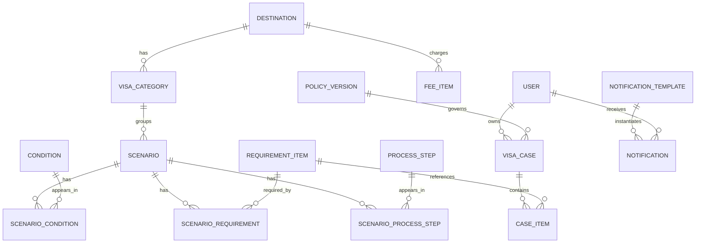

# 数据库设计 Implementation Plan

> **For agentic workers:** REQUIRED SUB-SKILL: Use superpowers:subagent-driven-development (recommended) or superpowers:executing-plans to implement this plan task-by-task. Steps use checkbox (`- [ ]`) syntax for tracking.

**Goal:** 为签证指南后端产出一份可执行的 PostgreSQL 数据库设计，覆盖规则、内容、用户案例、通知四类核心数据，并预留留学/商务/探亲等签证类型扩展口子。

**Architecture:** 使用 Prisma 作为 schema 单一事实来源，生成 PostgreSQL DDL 与类型。规则类数据（目的地、签证类型、场景、条件、材料、步骤、费用、政策版本）采用结构化表，业务多语言字段用 JSONB；用户办理案例与清单项独立成表，通过外键关联规则快照；通知模板按渠道+语言+版本存储。第一阶段只落旅游签数据，但 `visa_categories.code` 预留 `student`、`business`、`family_visit`。

**Tech Stack:** PostgreSQL 16、Prisma 6、TypeScript。

**Spec:** `docs/superpowers/specs/2026-09-23-visa-guide-app-design.md`

## Global Constraints

- 数据库引擎为 PostgreSQL；金额用「最小货币单位整数」`amount_minor` + ISO 4217 货币代码 `currency`，不做本地化金额换算。
- 多语言业务字段一律 JSONB（key 为 `zh-CN`/`en`/`ja`/`ko`），接口层负责选取目标语言与兜底。
- 所有表包含 `id`（UUID/`cuid`）、`created_at`、`updated_at`；删除采用软删除 `deleted_at` 或状态字段，不使用物理删除破坏关联。
- 规则必须版本化：`policy_versions` 记录生效时间与发布状态，任何清单生成结果都要关联命中版本，便于追溯。
- 时间统一存 UTC（`timestamptz`），展示层按用户时区与语言格式化。
- 第一版只发布 `tourist` 签证类型；`visa_categories.code` 使用枚举，枚举新增需走迁移。
- schema 中不得出现应用层专有硬编码规则；规则以数据行表达。

---

## File Structure

```text
.
├── docs/
│   └── database-design.md          # ERD + 逐表说明 + 约定
├── apps/
│   └── server/
│       └── prisma/
│           ├── schema.prisma       # Prisma schema（单一事实来源）
│           └── seed.ts             # 第一阶段示例数据（日本旅游签）
```

## Task 1: 设计文档与 Prisma schema

**Files:**
- Create: `docs/database-design.md`
- Create: `apps/server/prisma/schema.prisma`

**Interfaces:**
- Produces: `schema.prisma` 中定义以下 model：`User`、`VisaCase`、`CaseItem`、`Destination`、`VisaCategory`、`Scenario`、`Condition`、`ScenarioCondition`、`RequirementItem`、`ScenarioRequirement`、`ProcessStep`、`ScenarioProcessStep`、`FeeItem`、`TimelineEvent`、`PolicyVersion`、`Content`、`Faq`、`NotificationTemplate`、`Notification`。

- [ ] **Step 1: 写设计文档**

`docs/database-design.md` 内容：

```markdown
# 签证指南数据库设计

## 1. 设计原则

- 规则与内容数据驱动，规则版本化可追溯。
- 多语言字段用 JSONB，金额用最小单位整数 + 货币代码。
- 时间统一 UTC，软删除保留审计与关联。

## 2. ERD



## 3. 逐表说明

### 规则与内容域

- `destinations`：目的地国家或地区（日本、韩国、申根法/德/意、美国）。
- `visa_categories`：签证类型，第一版只有 tourist，预留 student/business/family_visit。
- `scenarios`：适用场景，描述条件组合；同一目的地+类型可有多个场景（如首签/续签）。
- `conditions`：条件项定义（护照有效期、户籍、是否首签、出行目的等）。
- `scenario_conditions`：场景与条件多对多，并带运算符与期望值，构成匹配规则。
- `requirement_items`：材料项（护照、照片、在职证明、银行流水等）。
- `scenario_requirements`：场景所需材料及是否必选、份数、说明。
- `process_steps`：办理步骤（填表、预约、递签、取签）。
- `scenario_process_steps`：场景步骤排序与预计耗时。
- `fee_items`：费用项（签证费、服务费等），金额用最小单位整数。
- `policy_versions`：规则版本，含生效时间、发布状态、备注。

### 用户案例域

- `users`：用户、登录方式、语言偏好、通知偏好。
- `visa_cases`：一次办理案例，绑定目的地、类型、当前答案 JSONB、状态、进度。
- `case_items`：案例中的清单项状态、备注、附件。

### 内容与通知域

- `contents`：资料库/政策文章，多语言 JSONB。
- `faqs`：常见问题，多语言 JSONB。
- `notification_templates`：按渠道+语言+版本的模板，`{{var}}` 占位符。
- `notifications`：实际发送记录、渠道、状态。
```

- [ ] **Step 2: 写 Prisma schema**

`apps/server/prisma/schema.prisma`：

```prisma
generator client {
  provider = "prisma-client-js"
}

datasource db {
  provider = "postgresql"
  url      = env("DATABASE_URL")
}

enum Locale {
  zh_CN
  en
  ja
  ko
}

enum VisaCategoryCode {
  tourist
  student
  business
  family_visit
}

enum PolicyStatus {
  draft
  published
  retired
}

enum VisaCaseStatus {
  draft
  in_progress
  ready_to_submit
  submitted
  completed
  archived
}

enum NotificationChannel {
  sms
  email
  mini_program
  push
  inbox
}

enum NotificationStatus {
  pending
  sent
  failed
  read
}

model User {
  id             String         @id @default(cuid())
  phone          String?        @unique
  language       Locale         @default(zh_CN)
  timezone       String         @default("Asia/Shanghai")
  notificationPrefs Json?
  authProviders  Json?
  createdAt      DateTime       @default(now()) @map("created_at")
  updatedAt      DateTime       @updatedAt @map("updated_at")
  cases          VisaCase[]
  notifications  Notification[]

  @@map("users")
}

model Destination {
  id           String   @id @default(cuid())
  code         String   @unique
  name         Json
  region       String?
  enabled      Boolean  @default(true)
  createdAt    DateTime @default(now()) @map("created_at")
  updatedAt    DateTime @updatedAt @map("updated_at")
  categories   VisaCategory[]
  feeItems     FeeItem[]

  @@map("destinations")
}

model VisaCategory {
  id            String            @id @default(cuid())
  destinationId String            @map("destination_id")
  code          VisaCategoryCode
  name          Json
  enabled       Boolean           @default(true)
  createdAt     DateTime          @default(now()) @map("created_at")
  updatedAt     DateTime          @updatedAt @map("updated_at")
  destination   Destination       @relation(fields: [destinationId], references: [id])
  scenarios     Scenario[]
  cases         VisaCase[]

  @@unique([destinationId, code])
  @@map("visa_categories")
}

model Scenario {
  id            String                @id @default(cuid())
  visaCategoryId String               @map("visa_category_id")
  code          String
  name          Json
  description   Json?
  enabled       Boolean               @default(true)
  createdAt     DateTime              @default(now()) @map("created_at")
  updatedAt     DateTime              @updatedAt @map("updated_at")
  category      VisaCategory          @relation(fields: [visaCategoryId], references: [id])
  conditions    ScenarioCondition[]
  requirements  ScenarioRequirement[]
  steps         ScenarioProcessStep[]

  @@unique([visaCategoryId, code])
  @@map("scenarios")
}

model Condition {
  id            String              @id @default(cuid())
  code          String              @unique
  name          Json
  inputType     String              @map("input_type")
  options       Json?
  createdAt     DateTime            @default(now()) @map("created_at")
  updatedAt     DateTime            @updatedAt @map("updated_at")
  scenarios     ScenarioCondition[]

  @@map("conditions")
}

model ScenarioCondition {
  id          String    @id @default(cuid())
  scenarioId  String    @map("scenario_id")
  conditionId String    @map("condition_id")
  operator    String    @default("eq")
  expected    Json
  createdAt   DateTime  @default(now()) @map("created_at")
  updatedAt   DateTime  @updatedAt @map("updated_at")
  scenario    Scenario  @relation(fields: [scenarioId], references: [id])
  condition   Condition @relation(fields: [conditionId], references: [id])

  @@unique([scenarioId, conditionId])
  @@map("scenario_conditions")
}

model RequirementItem {
  id          String                @id @default(cuid())
  code        String                @unique
  name        Json
  description Json?
  createdAt   DateTime              @default(now()) @map("created_at")
  updatedAt   DateTime              @updatedAt @map("updated_at")
  scenarios   ScenarioRequirement[]
  caseItems   CaseItem[]

  @@map("requirement_items")
}

model ScenarioRequirement {
  id                String          @id @default(cuid())
  scenarioId        String          @map("scenario_id")
  requirementItemId String          @map("requirement_item_id")
  required          Boolean         @default(true)
  quantity          Int             @default(1)
  sortOrder         Int             @default(0) @map("sort_order")
  notes             Json?
  createdAt         DateTime        @default(now()) @map("created_at")
  updatedAt         DateTime        @updatedAt @map("updated_at")
  scenario          Scenario        @relation(fields: [scenarioId], references: [id])
  requirementItem   RequirementItem @relation(fields: [requirementItemId], references: [id])

  @@unique([scenarioId, requirementItemId])
  @@map("scenario_requirements")
}

model ProcessStep {
  id          String                @id @default(cuid())
  code        String                @unique
  title       Json
  description Json?
  createdAt   DateTime              @default(now()) @map("created_at")
  updatedAt   DateTime              @updatedAt @map("updated_at")
  scenarios   ScenarioProcessStep[]

  @@map("process_steps")
}

model ScenarioProcessStep {
  id            String      @id @default(cuid())
  scenarioId    String      @map("scenario_id")
  processStepId String      @map("process_step_id")
  sortOrder     Int         @default(0) @map("sort_order")
  estimatedDays Int?        @map("estimated_days")
  createdAt     DateTime    @default(now()) @map("created_at")
  updatedAt     DateTime    @updatedAt @map("updated_at")
  scenario      Scenario    @relation(fields: [scenarioId], references: [id])
  processStep   ProcessStep @relation(fields: [processStepId], references: [id])

  @@unique([scenarioId, processStepId])
  @@map("scenario_process_steps")
}

model FeeItem {
  id            String      @id @default(cuid())
  destinationId String      @map("destination_id")
  code          String
  name          Json
  amountMinor   Int         @map("amount_minor")
  currency      String      @default("CNY")
  optional      Boolean     @default(false)
  createdAt     DateTime    @default(now()) @map("created_at")
  updatedAt     DateTime    @updatedAt @map("updated_at")
  destination   Destination @relation(fields: [destinationId], references: [id])

  @@map("fee_items")
}

model TimelineEvent {
  id          String   @id @default(cuid())
  code        String   @unique
  name        Json
  reminderDays Int?    @map("reminder_days")
  createdAt   DateTime @default(now()) @map("created_at")
  updatedAt   DateTime @updatedAt @map("updated_at")

  @@map("timeline_events")
}

model PolicyVersion {
  id             String       @id @default(cuid())
  destinationId  String       @map("destination_id")
  visaCategoryId String       @map("visa_category_id")
  version        String
  status         PolicyStatus @default(draft)
  effectiveAt    DateTime     @map("effective_at")
  notes          String?
  publishedAt    DateTime?    @map("published_at")
  createdAt      DateTime     @default(now()) @map("created_at")
  updatedAt      DateTime     @updatedAt @map("updated_at")
  cases          VisaCase[]

  @@map("policy_versions")
}

model VisaCase {
  id             String         @id @default(cuid())
  userId         String         @map("user_id")
  destinationId  String         @map("destination_id")
  visaCategoryId String         @map("visa_category_id")
  policyVersionId String?       @map("policy_version_id")
  answers        Json?
  status         VisaCaseStatus @default(draft)
  progress       Int            @default(0)
  createdAt      DateTime       @default(now()) @map("created_at")
  updatedAt      DateTime       @updatedAt @map("updated_at")
  user           User           @relation(fields: [userId], references: [id])
  policyVersion  PolicyVersion? @relation(fields: [policyVersionId], references: [id])
  items          CaseItem[]

  @@map("visa_cases")
}

model CaseItem {
  id                String          @id @default(cuid())
  visaCaseId        String          @map("visa_case_id")
  requirementItemId String          @map("requirement_item_id")
  status            String          @default("not_started")
  note              String?
  attachments       Json?
  createdAt         DateTime        @default(now()) @map("created_at")
  updatedAt         DateTime        @updatedAt @map("updated_at")
  visaCase          VisaCase        @relation(fields: [visaCaseId], references: [id])
  requirementItem   RequirementItem @relation(fields: [requirementItemId], references: [id])

  @@map("case_items")
}

model Content {
  id        String   @id @default(cuid())
  slug      String   @unique
  title     Json
  body      Json
  status    String   @default("draft")
  publishedAt DateTime? @map("published_at")
  createdAt DateTime @default(now()) @map("created_at")
  updatedAt DateTime @updatedAt @map("updated_at")

  @@map("contents")
}

model Faq {
  id        String   @id @default(cuid())
  category  String?
  question  Json
  answer    Json
  sortOrder Int      @default(0) @map("sort_order")
  createdAt DateTime @default(now()) @map("created_at")
  updatedAt DateTime @updatedAt @map("updated_at")

  @@map("faqs")
}

model NotificationTemplate {
  id        String              @id @default(cuid())
  code      String
  channel   NotificationChannel
  locale    Locale
  subject   String?
  body      String
  variables Json?
  version   Int                 @default(1)
  status    String              @default("active")
  createdAt DateTime            @default(now()) @map("created_at")
  updatedAt DateTime            @updatedAt @map("updated_at")

  @@unique([code, channel, locale, version])
  @@map("notification_templates")
}

model Notification {
  id         String              @id @default(cuid())
  userId     String              @map("user_id")
  templateId String              @map("template_id")
  channel    NotificationChannel
  status     NotificationStatus  @default(pending)
  payload    Json?
  error      String?
  sentAt     DateTime?           @map("sent_at")
  createdAt  DateTime            @default(now()) @map("created_at")
  updatedAt  DateTime            @updatedAt @map("updated_at")
  user       User                @relation(fields: [userId], references: [id])
  template   NotificationTemplate @relation(fields: [templateId], references: [id])

  @@map("notifications")
}
```

- [ ] **Step 3: 校验 schema 语法**

Run: `npx prisma validate --schema apps/server/prisma/schema.prisma`
Expected: 输出 `The schema at ... is valid`。

- [ ] **Step 4: 提交**

```bash
git add docs/database-design.md apps/server/prisma/schema.prisma
git commit -m "feat: add PostgreSQL database design and Prisma schema"
```

## Task 2: 第一阶段示例数据

**Files:**
- Create: `apps/server/prisma/seed.ts`
- Modify: `docs/database-design.md`

**Interfaces:**
- Produces: 可被 `prisma db seed` 执行的种子脚本，插入日本旅游签的最小可用示例（1 目的地 + 1 签证类型 + 1 场景 + 4 材料 + 3 步骤 + 1 政策版本 + 若干条件）。所有业务文案为真实示例并标注「待官方复核」。

- [ ] **Step 1: 写 seed 脚本**

`apps/server/prisma/seed.ts`：

```ts
import { PrismaClient, VisaCategoryCode } from '@prisma/client'

const prisma = new PrismaClient()

const text = (zh: string, en: string, ja: string, ko: string) => ({
  'zh-CN': zh,
  en,
  ja,
  ko
})

async function main () {
  const japan = await prisma.destination.upsert({
    where: { code: 'japan' },
    update: {},
    create: {
      code: 'japan',
      name: text('日本', 'Japan', '日本', '일본'),
      region: 'asia'
    }
  })

  const category = await prisma.visaCategory.upsert({
    where: { destinationId_code: { destinationId: japan.id, code: VisaCategoryCode.tourist } },
    update: {},
    create: {
      destinationId: japan.id,
      code: VisaCategoryCode.tourist,
      name: text('旅游签证', 'Tourist Visa', '観光ビザ', '관광 비자')
    }
  })

  const passport = await prisma.requirementItem.upsert({
    where: { code: 'japan_tourist_passport' },
    update: {},
    create: {
      code: 'japan_tourist_passport',
      name: text('护照原件', 'Original passport', 'パスポート原本', '여권 원본'),
      description: text('有效期 6 个月以上，且有空白页。', 'Valid for at least 6 months with blank pages.', '有効期限が6か月以上あり、余白ページがあること。', '유효기간 6개월 이상, 빈 페이지 필요.')
    }
  })

  const photo = await prisma.requirementItem.upsert({
    where: { code: 'japan_tourist_photo' },
    update: {},
    create: {
      code: 'japan_tourist_photo',
      name: text('签证照片', 'Visa photo', 'ビザ用写真', '비자 사진'),
      description: text('近 6 个月白底彩色照片。', 'Color photo with white background taken within 6 months.', '6か月以内に撮影した白背景のカラー写真。', '6개월 이내 촬영한 흰색 배경 컬러 사진.')
    }
  })

  const form = await prisma.requirementItem.upsert({
    where: { code: 'japan_tourist_form' },
    update: {},
    create: {
      code: 'japan_tourist_form',
      name: text('签证申请表', 'Visa application form', '査証申請書', '비자 신청서'),
      description: text('按使领馆要求如实填写。', 'Complete truthfully per the consulate requirements.', '領事館の要件に従って正確に記入する。', '영사관 요구사항에 따라 정확히 작성.')
    }
  })

  const funds = await prisma.requirementItem.upsert({
    where: { code: 'japan_tourist_funds' },
    update: {},
    create: {
      code: 'japan_tourist_funds',
      name: text('经济能力证明', 'Proof of financial capacity', '経済力の証明', '경제 능력 증명'),
      description: text('银行流水或存款证明。', 'Bank statements or deposit certificate.', '銀行取引明細または預金証明書。', '은행 거래 내역 또는 예금 증명.')
    }
  })

  await prisma.scenario.create({
    data: {
      visaCategoryId: category.id,
      code: 'default_tourist',
      name: text('普通旅游签证', 'Standard tourist visa', '一般観光ビザ', '일반 관광 비자'),
      requirements: {
        create: [
          { requirementItemId: passport.id, required: true, quantity: 1, sortOrder: 1 },
          { requirementItemId: photo.id, required: true, quantity: 2, sortOrder: 2 },
          { requirementItemId: form.id, required: true, quantity: 1, sortOrder: 3 },
          { requirementItemId: funds.id, required: true, quantity: 1, sortOrder: 4 }
        ]
      },
      steps: {
        create: [
          {
            processStep: {
              create: { code: 'japan_tourist_fill_form', title: text('填写申请表', 'Complete application form', '申請書を記入する', '신청서 작성') }
            },
            sortOrder: 1,
            estimatedDays: 1
          },
          {
            processStep: {
              create: { code: 'japan_tourist_submit', title: text('递交材料', 'Submit documents', '書類を提出する', '서류 제출') }
            },
            sortOrder: 2,
            estimatedDays: 1
          },
          {
            processStep: {
              create: { code: 'japan_tourist_collect', title: text('领取护照', 'Collect passport', 'パスポートを受け取る', '여권 수령') }
            },
            sortOrder: 3,
            estimatedDays: 5
          }
        ]
      }
    }
  })

  await prisma.policyVersion.create({
    data: {
      destinationId: japan.id,
      visaCategoryId: category.id,
      version: '2026.09.01',
      status: 'draft',
      effectiveAt: new Date('2026-09-01T00:00:00Z'),
      notes: '示例数据，待官方复核'
    }
  })
}

main()
  .catch(error => {
    console.error(error)
    process.exit(1)
  })
  .finally(async () => {
    await prisma.$disconnect()
  })
```

- [ ] **Step 2: 标注待复核说明**

在 `docs/database-design.md` 末尾追加：

```markdown
## 4. 种子数据说明

`apps/server/prisma/seed.ts` 中的日本旅游签材料、步骤为「待官方复核」示例，仅用于验证 schema 形状，上线前必须由负责人按使领馆官方口径核对。
```

- [ ] **Step 3: 类型检查 seed**

Run: `pnpm --filter @vcc/server exec tsc --noEmit apps/server/prisma/seed.ts`（若 server 包尚未创建，则先跳过此步并在 Task 1 完成后再校验）
Expected: 无类型错误。

- [ ] **Step 4: 提交**

```bash
git add apps/server/prisma/seed.ts docs/database-design.md
git commit -m "feat: add Japan tourist visa seed data with review disclaimer"
```
